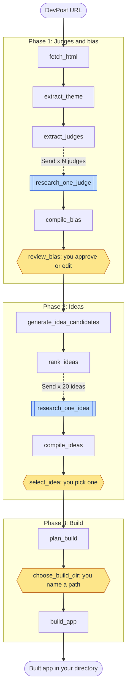
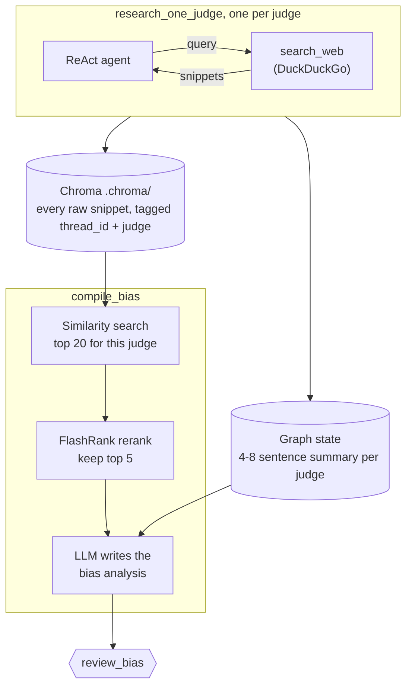
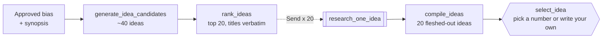
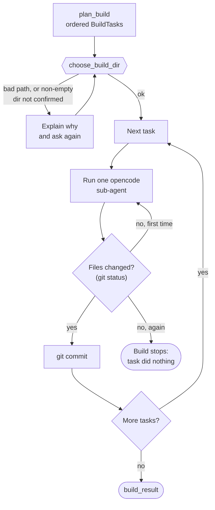
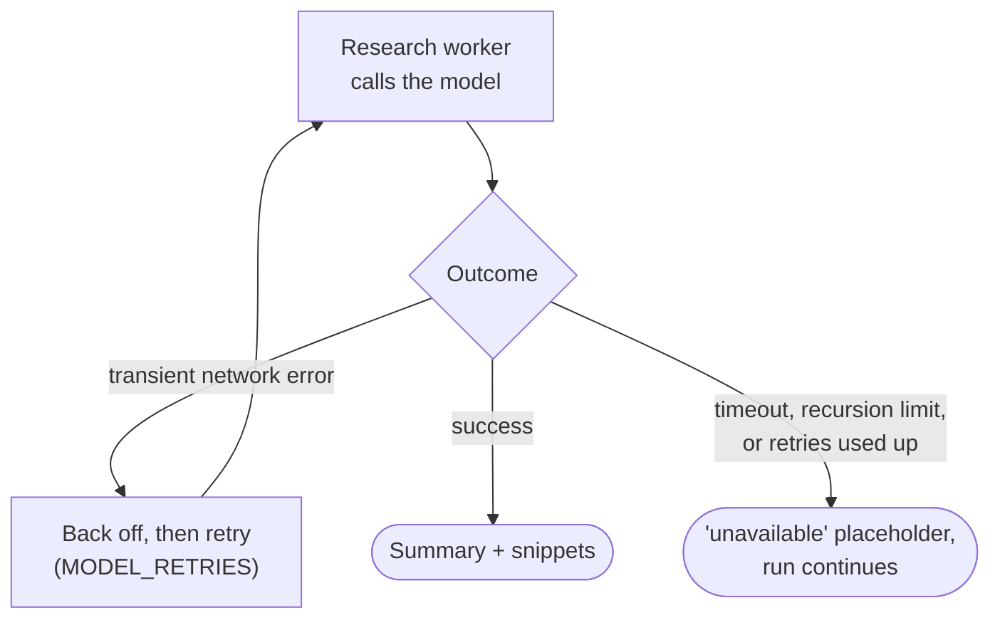

# Hack2Thon

**A multi-agent system that takes a DevPost hackathon page and carries it all the way to a built app.**

Point it at a DevPost URL.
It reads the page, researches every judge, works out what the panel is biased toward, brainstorms and researches app ideas that fit that bias, and then builds the one you pick into a directory on your machine.

Built on [LangGraph](https://github.com/langchain-ai/langgraph), running on [Ollama](https://ollama.com) models, with [opencode](https://opencode.ai) coding agents for the build.

- [How it works](#how-it-works)
- [Phase 1: Judges and bias](#phase-1-judges-and-bias)
- [Phase 2: Ideas](#phase-2-ideas)
- [Phase 3: Build](#phase-3-build)
- [Resilience](#resilience)
- [Setup](#setup)
- [Run](#run)
- [Tests](#tests)

## How it works

The whole pipeline is one LangGraph `StateGraph` in three phases.
It stops three times to ask you something, shown in amber below.



The two blue nodes are **fan-outs**.
An orchestrator returns one `Send` per judge or idea, the workers run in parallel (throttled by an `asyncio.Semaphore`), and the next node fans them back in.
Parallel workers write to the same state field, so those fields merge through reducers: `merge_judges` upserts by name and `merge_ideas` upserts by title.

## Phase 1: Judges and bias

The page is fetched and stripped to text, then the theme and the judges are extracted from it.
Each judge gets a ReAct research agent with a DuckDuckGo `search_web` tool.

Every raw search result those agents read is also kept in a Chroma vector store, not just their short summaries.
When `compile_bias` writes the panel analysis, it pulls each judge's most relevant evidence back out and reranks it, so the analysis rests on what the searches actually found.



The bias analysis has four sections: technology preferences, domain and industry leanings, presentation and style preferences, and hard signals and red flags.
You can edit it before anything else runs, and your edited version is what the rest of the pipeline uses.

Details worth knowing:
- Embeddings come from a local Ollama (`qwen3-embedding:0.6b`), separate from the chat model, which may be on Ollama Cloud.
- Notes are scoped per run, so one hackathon's research never leaks into another.
- If the store is unavailable, `compile_bias` falls back to summaries only and says so.

## Phase 2: Ideas



Each idea researcher looks at three things: feasibility within a hackathon, similar existing projects, and the "winning formula" of past winners.
`compile_ideas` turns each one into a full spec: problem, target users, core features, tech stack, differentiation, how it fits the panel's bias, and feasibility notes.

## Phase 3: Build

`plan_build` breaks the chosen idea into an ordered list of small build tasks.
You name an absolute directory, which is created if missing and `git init`ed so every step can be diffed and reverted.



The build is deliberately **sequential**, unlike the research fan-outs.
Task N+1 reads the files task N wrote, so parallel coding agents in one directory would clobber each other.

A sub-agent that exits successfully but changes nothing counts as a failure, not a success.
Some models return an empty response and exit 0, so success is checked against `git status`, never the exit code.

Each sub-agent's output streams to the console as it runs (tool calls, file writes, diffs, shell commands), with a `[n/N]` header and a commit diffstat per task.

## Resilience

A full run takes a while, so one flaky network call must not throw it away.



- **Model calls** retry transient network failures, since Ollama Cloud sometimes drops connections mid-response.
- **Fan-out workers degrade.** A judge or idea whose research fails gets a clear "unavailable" placeholder, and the run goes on with its peers.
- **Single nodes fail loudly.** A step like `rank_ideas` has no peer to fall back on, and a made-up result would be worse than stopping.
- **Search never crashes the agent.** A failed search comes back as a tool result telling the agent to retry at most once and then carry on without it.
- **Everything is checkpointed**, so a crash or Ctrl+C can be resumed from the last completed step.

## Setup

```bash
uv sync
cp .env.example .env              # then fill in your Ollama + LangSmith config
ollama pull qwen3-embedding:0.6b  # local embeddings for judge research notes
```

The build phase also needs the [opencode](https://opencode.ai) CLI on your `PATH`.
The first run downloads the FlashRank reranker (about 22MB) to `~/.cache/flashrank`.

| Variable | Default | What it does |
| --- | --- | --- |
| `OLLAMA_MODEL` | `minimax-m3:cloud` | Chat model for every agent (cloud or local) |
| `EMBED_MODEL` | `qwen3-embedding:0.6b` | Embedding model for judge research notes |
| `EMBED_BASE_URL` | local Ollama | Where embeddings are served; separate from `OLLAMA_BASE_URL` on purpose |
| `JUDGE_RESEARCH_CONCURRENCY` | `2` | Parallel judge researchers; lower if Ollama says "too many concurrent requests" |
| `IDEA_RESEARCH_CONCURRENCY` | `2` | Parallel idea researchers |
| `RESEARCH_TIMEOUT` | `300` | Seconds before a stalled research worker is abandoned |
| `RESEARCH_RECURSION_LIMIT` | `40` | Steps a research agent may take |
| `MODEL_RETRIES` | `3` | Attempts per model call on transient network errors |
| `BUILD_MODEL` | `ollama/minimax-m3` | `provider/model` for the coding sub-agents |
| `BUILD_TASK_TIMEOUT` | `900` | Seconds one coding sub-agent may run before it is killed |

## Run

The CLI runs the whole pipeline in one process:

```bash
uv run python -m agent.cli https://your-hackathon.devpost.com
```

It prints each phase as it finishes, streams build output live, and asks its three questions in the terminal.
Every run is checkpointed to `.runs.db`, so you can quit or crash and pick up where you left off:

```bash
uv run python -m agent.cli ls              # list past runs, newest first
uv run python -m agent.cli --thread <id>   # resume one; the id is printed when a run starts
```

`ls` shows when each run started, how far it got, whether it is waiting on you, and which page it was for.

You can also drive the graph from LangGraph Studio:

```bash
uv run langgraph dev
```

Invoke it with the DevPost URL as `devpost_url`.
Final state includes `hackathon_synopsis`, the researched `judges`, `judge_bias`, the 20 `final_ideas`, the `build_plan`, and a `build_result` saying which tasks succeeded and where the app was written.

## Tests

All tests are hermetic: no model calls, no network.

```bash
uv run python tests/test_build_app.py       # build phase
uv run python tests/test_cli_driver.py      # CLI driver loop through repeated interrupts
uv run python tests/test_graph_topology.py  # fan-in nodes run exactly once
uv run python tests/test_cli_e2e.py         # whole pipeline through the CLI on dummy data
uv run python tests/test_tools.py           # search failures degrade, not crash
uv run python tests/test_resilience.py      # retries and degraded workers
uv run python tests/test_rag.py             # judge notes: scoping, dedupe, rerank
```
